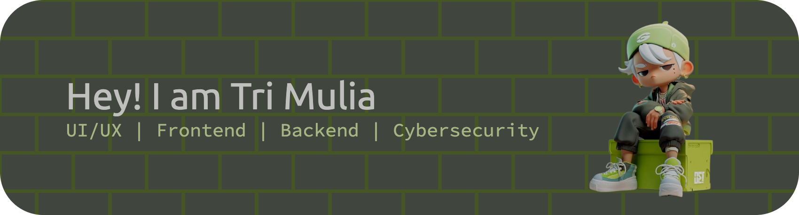

# Hi there! 👋

<!-- Banner (Optional) -->

  

<!-- Animated Typing Text -->

  

## About Me 

  🚀 Computer Engineering graduate passionate about UI/UX, Backend, Frontend, and Cybersecurity. 
  💡 Always learning, building, and exploring new tech!

## 📫 Connect With Me

  
  
  

---

## 🛠️ Tech Stack & Tools 

  <!-- Programming Languages -->
  
  
  
  
  
  
  <!-- Web & App Frameworks -->
  
  
  
  
  <!-- Design & Productivity -->
  
  
  <!-- DevOps & Cloud -->
  
  
  
  
  <!-- Security & Pentest -->
  
  
  
  
  
  
  
  <!-- Development Tools -->
  
  

---

## 📊 GitHub Statistics

  

  

---

## 🎮 Contribution Activity

<picture>
  <source media="(prefers-color-scheme: dark)" srcset="https://raw.githubusercontent.com/Trimulia02/Trimulia02/output/pacman-contribution-graph-dark.svg">
  <source media="(prefers-color-scheme: light)" srcset="https://raw.githubusercontent.com/Trimulia02/Trimulia02/output/pacman-contribution-graph.svg">
  
</picture>

---

  <i>Thanks for visiting my profile! Feel free to reach out and connect! 🚀</i>

