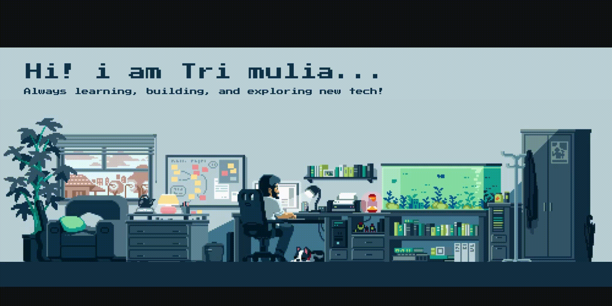

<!-- Animated Typing Text -->
<div align="center">
  
</div>

<!-- Banner -->
<div align="center">
  
</div>

<br>

##  About Me

<div align="center">
  
**💡 Passionate Developer | 🛡️ Security Enthusiast | 🎯 Problem Solver**

*Computer Engineering graduate with a mission to build secure, efficient, and impactful software solutions. I thrive on turning complex problems into elegant code and am always eager to learn cutting-edge technologies.*

</div>


### 🌟 What Drives Me
- 🚀 **Innovation**: Always exploring new technologies and frameworks
- 🔐 **Security**: Passionate about cybersecurity and ethical hacking
- 🌍 **Impact**: Building solutions that make a difference
- 📚 **Learning**: Continuous growth and skill development

<div align="center">

### 📫 Let's Connect & Collaborate

<a href="mailto:trimulia002@gmail.com">
  
</a>
<a href="https://linkedin.com/in/tri-mulia/">
  
</a>
<a href="https://www.instagram.com/trimuliab">
  
</a>

</div>


##  Tech Arsenal

### 💻 Core Programming Languages
<div align="center">
  
</div>

<div align="center">
  
| Language | Proficiency | Experience |
|----------|------------|------------|
| **Python** | ⭐⭐⭐⭐⭐ | Advanced - Main language for development & security |
| **JavaScript** | ⭐⭐⭐⭐ | Proficient - Full-stack web development |
| **Kotlin** | ⭐⭐⭐ | Intermediate - Android development |
| **HTML/CSS** | ⭐⭐⭐⭐ | Proficient - Modern responsive design |

</div>

### 🎨 Frontend Development
<div align="center">
  
</div>

### ⚡ Backend & Database
<div align="center">
  
</div>

### 🛠️ Development Tools & Platforms
<div align="center">
  
</div>


##  Cybersecurity & Penetration Testing

<div align="center">

### 🛡️ Security Toolkit


</div>

<div align="center">

| Security Area | Tools & Techniques |
|---------------|-------------------|
| **Network Analysis** | Wireshark, Nmap, Network Mapping |
| **Password Security** | John the Ripper, Hashcat, Hydra |
| **Wireless Security** | Aircrack-ng, WiFi Penetration Testing |
| **Web Security** | OWASP Top 10, Vulnerability Assessment |

</div>


##  GitHub Analytics

<div align="center">
  


</div>

### 🏆 GitHub Trophies
<div align="center">
  
</div>

## 🎮 Contribution Activity

<div align="center">

### 📈 Contribution Graph
<picture>
  <source media="(prefers-color-scheme: dark)" srcset="https://raw.githubusercontent.com/Trimulia02/Trimulia02/output/pacman-contribution-graph-dark.svg">
  <source media="(prefers-color-scheme: light)" srcset="https://raw.githubusercontent.com/Trimulia02/Trimulia02/output/pacman-contribution-graph.svg">
  
</picture>

### ⚡ GitHub Streak
[](https://git.io/streak-stats)

</div>


## 🎯 Current Focus

<div align="center">

```text
🔭 Currently working on: Cybersecurity projects and web development
🌱 Learning: Advanced penetration testing and cloud security
👯 Looking to collaborate on: Open source security tools
🤔 Seeking help with: Machine learning in cybersecurity
💬 Ask me about: Python, JavaScript, cybersecurity, or anything tech!
⚡ Fun fact: I debug code faster than I debug my life 😄
```

</div>

## 🚀 Featured Projects

<div align="center">

[](https://github.com/Trimulia02/AirMalSys)
[](https://github.com/Trimulia02/another-cool-project)

</div>

---

<div align="center">
  
### 💫 Profile Views Counter


 

**Thanks for visiting my profile!** 

*Let's build something amazing together! 🚀*


</div>

---

<div align="center">
  
</div>
